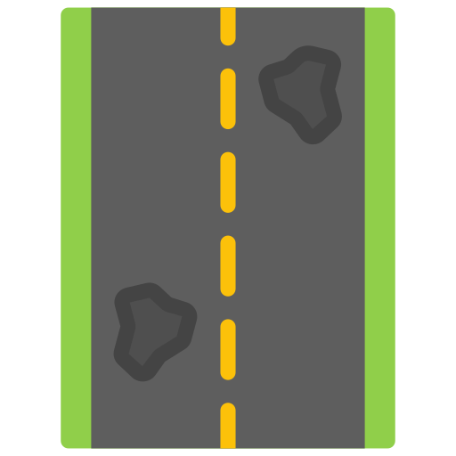

# 🕳️ Pothole Detection App

A real-time pothole detection web app built using **YOLOv8**, **OpenCV**, and **Streamlit**.



---

## 🚀 Live App

👉 [Click here to use the live app](https://rudranipatil30-pothole-detection-app.streamlit.app)

---

## 💡 Features

- 🔍 Real-time detection via webcam
- 🎞️ Video upload support (.mp4, .avi, etc.)
- 🧠 Powered by custom-trained **YOLOv8 instance segmentation**
- ✅ Works entirely in the browser

---

## 🛠 Tech Stack

- [YOLOv8](https://docs.ultralytics.com/)
- [Streamlit](https://streamlit.io/)
- OpenCV
- Python 3.10+

---

## ⚙️ Installation (Local)

1. Clone the repo  
```bash
git clone https://github.com/Rudranipatil30/pothole-detection-app.git
cd pothole-detection-app
